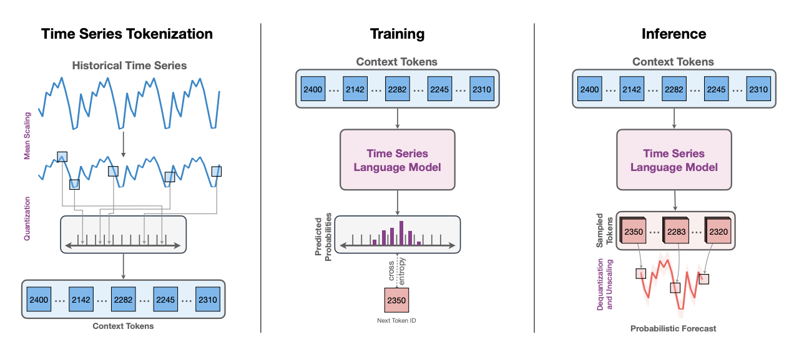

# Tokenizer
ltsm_hf/ltsm_hf/scripts/train_csv_tokenizer.sh

use cross_entropy to calculate loss.

- ETT-small
  - ETT-h1.csv
  - ETT-h2.csv
  - ETT-m1.csv
  - ETT-m2.csv
- electricity
  - electricity.csv
- exchange_rate
  - exchange_rate.csv
- illness
  - national_illness.csv (deprecated)
- traffic
  - traffic.csv
- weather
  - weather.csv
